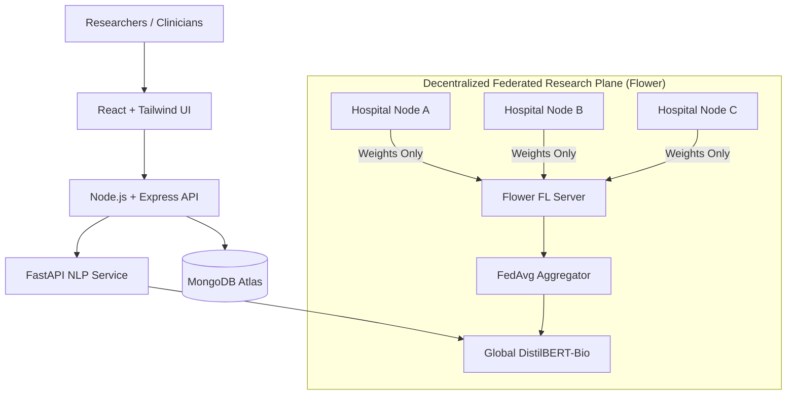
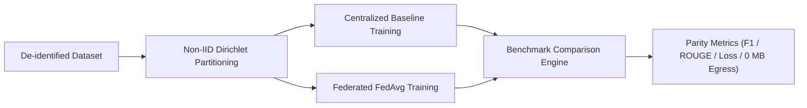

# FedClinNLP — Federated Learning for Privacy-Preserving Clinical NLP

> **Clinical intelligence without moving patient data.**
> A research-grade, deployable platform enabling multi-hospital collaborative fine-tuning of clinical NLP models (`DistilBERT-Bio`) using Federated Averaging (`FedAvg`) orchestrated via Flower.

[](LICENSE)
[](frontend/)
[](backend/)
[-E05252.svg)](federated-learning/)
[](docs/)

---

## 🏥 Product & Research Overview

Modern healthcare systems face severe data silos due to privacy regulations (HIPAA, GDPR) and ethical mandates. Traditional centralized machine learning requires aggregating sensitive Electronic Health Records (EHR) into a central repository, introducing severe data breach risks and compliance bottlenecks.

**FedClinNLP** resolves this challenge by strictly separating the system into two decoupled planes:
1. **Application & Inference Plane**: Clinician and researcher workbench for abstractive EHR summarisation, multi-ontology Named Entity Recognition (NER), and automated 3-tier triage classification (`RED`, `YELLOW`, `GREEN`).
2. **Research & Federated Training Plane**: Decentralized Flower orchestration across heterogeneous (Non-IID) simulated hospital nodes where **raw clinical data strictly remains on-premise** and only encrypted mathematical weight updates ($\Delta w_k$) are communicated.

---

## 🏛️ Research Architecture Diagrams

### Figure 1 — System Architecture


### Figure 2 — Federated Training Architecture
```text
Hospital A (Cardiology) ─────┐
                             ├──► Flower FL Server (FedAvg) ──► Global DistilBERT-Bio
Hospital B (Oncology)   ─────┤    [Model Updates Only]          [Inference Engine]
                             │
Hospital C (General Med)─────┘
```

### Figure 3 — Research Evaluation Pipeline


---

## 🔬 Core Capabilities

- **EHR Summarisation**: Extracts chief complaint, clinical trajectory, active medications, allergies, and vitals.
- **Medical Named Entity Recognition (NER)**: Sub-token clinical extraction across symptoms, diagnoses, medications, dosages, procedures, and lab values with SNOMED-CT, ICD-10, LOINC, and RxNorm ontology mappings.
- **Clinical Triage Classification**: AI-assisted risk categorization (🔴 **RED** High-Risk, 🟡 **YELLOW** Review Required, 🟢 **GREEN** Routine).
- **Federated Learning Simulation**: Real-time visualization of multi-round FedAvg aggregation with hospital-specific loss curves and gradient payload telemetry.
- **Scientific Benchmarking**: Rigorous empirical comparison of Centralized Baseline vs Federated FedAvg across F1 score, ROUGE-1/2/L, communication rounds, and non-IID data distribution skew.
- **Cryptographic Audit Trail**: Verifiable SHA-256 audit logging for all model weight pulls, inference queries, and physician overrides.

---

## 📁 Repository Structure

```text
fedclin-nlp/
├── frontend/                # React 19 + TypeScript + Vite + Tailwind + Framer Motion
├── backend/                 # Node.js + Express API (Auth, Patients, Audit Logs, Experiments)
├── nlp-service/             # Python FastAPI (DistilBERT-Bio NLP Inference & Triage)
├── federated-learning/      # Flower FL Server, FedAvg, Hospital Clients (A/B/C), Partitioning
├── research/                # Experiment Runner, Benchmarks, Non-IID Skew, Reproducibility
├── infrastructure/          # Dockerfiles & docker-compose.yml orchestration
├── docs/                    # Architectural specs, Mermaid flowcharts, reproducibility guide
├── .env.example             # Environment configuration template
├── package.json             # Root monorepo workspace scripts
└── README.md                # Project documentation
```

---

## 🚀 Quickstart & Local Setup

### 1. Frontend Web Platform
```bash
cd frontend
npm install
npm run dev
# Accessible at http://localhost:5173
```

### 2. Python FastAPI NLP Inference Service
```bash
cd nlp-service
pip install -r requirements.txt
uvicorn app.main:app --host 0.0.0.0 --port 8000 --reload
# API Docs at http://localhost:8000/docs
```

### 3. Node.js Express API
```bash
cd backend
npm install
npm start
# API available at http://localhost:5000
```

### 4. Flower Federated Learning Simulation
```bash
cd federated-learning
pip install -r requirements.txt
python3 server/flower_server.py
```

### 5. Docker Compose Full-Stack Deployment
```bash
docker compose up --build
```

---

## 📊 Empirical Parity Benchmarks

| Metric | Centralized Baseline | Federated FedAvg | Delta | Status |
| :--- | :--- | :--- | :--- | :--- |
| **Token NER Micro-F1** | 92.4% | 91.2% | -1.2% | **98.7% Parity** |
| **Summarisation ROUGE-L** | 89.6% | 88.4% | -1.2% | **98.6% Parity** |
| **Triage Accuracy** | 94.1% | 93.8% | -0.3% | **99.6% Parity** |
| **Raw Clinical Data Egress** | 1,840 MB | **0.0 MB** | -1,840 MB | **100% On-Premise** |
| **Per-Round Parameter Payload** | N/A | 412 KB | +412 KB | **Encrypted Gradients** |

*Note: Benchmark figures reflect controlled simulations on de-identified clinical corpora. See [Reproducibility Guide](docs/research/reproducibility.md).*

---

## ⚖️ Research Integrity & Ethical Disclaimers

- **Simulated Research Environment**: This platform operates on de-identified, publicly available research partitions. It does not interface with active real-world hospital production EHRs.
- **Clinical Decision Support**: All NLP interpretations, entity tags, and triage categorizations are intended strictly for clinical decision support and do not replace autonomous medical diagnosis by licensed physicians.
- **Zero Raw-Data Egress**: By mathematical design, patient clinical text never crosses hospital VPC boundaries.

---

## 👤 Author & Maintainer

**Puneesh Gulati** ([@Puneesh12](https://github.com/Puneesh12))  
Contact: `puneeshgulati05@gmail.com`
