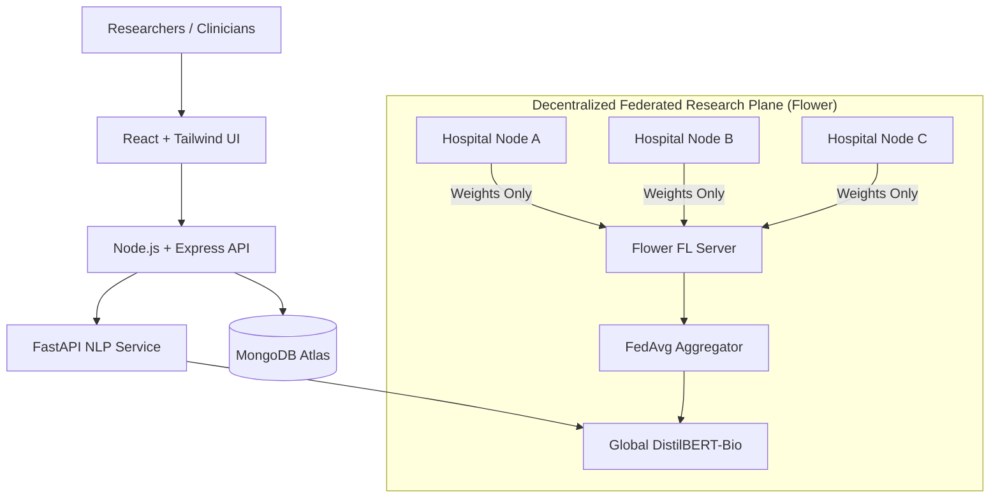

# FedClinNLP — Federated Learning for Privacy-Preserving Clinical NLP

> **Clinical intelligence without moving patient data.**
> A research-grade, privacy-first platform enabling multi-hospital collaborative training of clinical NLP models (`DistilBERT-Bio`) using Federated Averaging (`FedAvg`) orchestrated via Flower.

[](LICENSE)
[](frontend/)
[](backend/)
[-E05252.svg)](federated-learning/)
[](docs/)

---

## 🏥 Product & Research Overview

Modern healthcare systems face severe data silos due to privacy regulations (HIPAA, GDPR) and ethical mandates. Traditional centralized machine learning requires aggregating sensitive Electronic Health Records (EHR) into a central repository, introducing severe data breach risks and compliance bottlenecks.

**FedClinNLP** solves this dilemma through a decoupled two-plane architecture:
1. **Application / Inference Plane**: Clinical workbench for EHR summarization, Named Entity Recognition (NER), and multi-tier triage classification powered by the global federated DistilBERT-Bio model.
2. **Research / Federated Training Plane**: Decentralized Flower orchestration across heterogeneous (Non-IID) simulated hospital nodes where **raw clinical data strictly remains on-premise** and only encrypted mathematical weight updates ($\Delta w_k$) are communicated.

```
       HOSPITAL A (Cardiology)  ──┐
                                  ├──►  Flower FL Server (FedAvg)  ──►  Global DistilBERT-Bio
       HOSPITAL B (Oncology)    ──┤     [Model Updates Only]            [Inference Engine]
                                  │
       HOSPITAL C (General Med) ──┘
```

---

## 🏛️ System Architecture



See the full [System Flowchart & Architectural Specification](docs/architecture/system_flowchart.md).

---

## 🔬 Core Capabilities

- **EHR Summarisation**: Extracts chief complaint, clinical trajectory, active medications, allergies, and vitals.
- **Medical Named Entity Recognition (NER)**: Sub-token clinical extraction across symptoms, diagnoses, medications, dosages, procedures, and lab values.
- **Clinical Triage Classification**: AI-assisted risk categorization (🔴 **RED** High-Risk, 🟡 **YELLOW** Review Required, 🟢 **GREEN** Routine).
- **Federated Learning Simulation**: Real-time visualization of multi-round FedAvg aggregation with hospital-specific loss curves and gradient payload telemetry.
- **Scientific Benchmarking**: Rigorous empirical comparison of Centralized Baseline vs Federated FedAvg across F1 score, ROUGE-1/2/L, communication rounds, and non-IID data distribution skew.
- **HIPAA-Aligned Audit Trail**: Cryptographically verifiable audit logging for all model weight pulls and clinical inference queries.

---

## 📁 Repository Structure

```text
fedclin-nlp/
├── frontend/                # React 19 + TypeScript + Vite + Tailwind + Framer Motion
├── backend/                 # Node.js + Express API (Auth, Patients, Audit Logs, Experiments)
├── nlp-service/             # Python FastAPI (DistilBERT-Bio NLP Inference & Triage)
├── federated-learning/      # Flower FL Server, FedAvg, Hospital Clients (A/B/C), Partitioning
├── research/                # Experiment Runner, Benchmarks, Non-IID Skew, Reproducibility
├── infrastructure/          # Dockerfiles & docker-compose.yml orchestration
├── docs/                    # Architectural specs, Mermaid flowcharts, reproducibility guide
├── .env.example             # Environment configuration template
├── package.json             # Root monorepo workspace scripts
└── README.md                # Project documentation
```

---

## 🚀 Quickstart

### Prerequisites
- Node.js `>= 18.0.0`
- Python `>= 3.10`
- Git

### Frontend Setup
```bash
cd frontend
npm install
npm run dev
```

---

## ⚖️ Research Integrity & Disclaimers
- **Academic Simulation**: This system operates on de-identified, publicly available clinical research partitions. It does not interface with active real-world hospital infrastructure.
- **Decision Support**: All clinical NLP outputs are designed strictly for AI-assisted clinical decision support and do not constitute autonomous medical diagnoses.

---

## 👤 Author
**Puneesh Gulati** ([@Puneesh12](https://github.com/Puneesh12))
