# System Architecture Flowchart — FedClinNLP

This document captures the complete architectural blueprint of **FedClinNLP** (Federated Learning for Privacy-Preserving Clinical NLP), establishing the strict privacy boundaries between the user-facing Application Plane and the decentralized Federated Learning Research / Training Plane.

```mermaid
flowchart TB

    %% =========================================================
    %% USERS
    %% =========================================================

    U[Researchers / Clinicians / Evaluators]

    %% =========================================================
    %% PRESENTATION LAYER
    %% =========================================================

    subgraph PRESENTATION["Presentation Layer"]
        WEB[React + Tailwind<br/>Research & Clinical Dashboard]
        AUTH_UI[Authentication / RBAC]
        BENCH_UI[Benchmark & Experiment Visualization]
        FL_UI[Federated Learning Monitor]
        EHR_UI[EHR / Clinical NLP Interface]
    end

    U --> WEB
    WEB --> AUTH_UI
    WEB --> BENCH_UI
    WEB --> FL_UI
    WEB --> EHR_UI

    %% =========================================================
    %% APPLICATION LAYER
    %% =========================================================

    subgraph APPLICATION["Application / API Layer"]

        API[Node.js + Express API]

        AUTH[Authentication Service<br/>JWT + bcrypt]
        PATIENT[Patient / EHR Service]
        AUDIT[Audit Logging Service]
        EXP_API[Experiment Management API]
        MODEL_API[Model / Version API]

    end

    WEB --> API

    API --> AUTH
    API --> PATIENT
    API --> AUDIT
    API --> EXP_API
    API --> MODEL_API

    %% =========================================================
    %% AI INFERENCE
    %% =========================================================

    subgraph AI["Clinical AI Inference Layer"]

        FASTAPI[Python + FastAPI<br/>NLP Inference Service]

        NER[Medical NER]
        SUMMARY[EHR Summarisation]
        TRIAGE[Triage Engine]

        MODEL[Global DistilBERT-Bio<br/>Federated Model]

    end

    API --> FASTAPI

    FASTAPI --> NER
    FASTAPI --> SUMMARY
    FASTAPI --> TRIAGE

    NER --> MODEL
    SUMMARY --> MODEL
    TRIAGE --> MODEL

    %% =========================================================
    %% FEDERATED LEARNING CONTROL PLANE
    %% =========================================================

    subgraph FL["Federated Learning Control Plane"]

        FL_SERVER[Flower FL Server]

        FEDAVG[FedAvg Aggregator]

        ROUND[Round Manager]

        MODEL_REG[Model Version / Registry]

    end

    FL_SERVER --> FEDAVG
    FL_SERVER --> ROUND
    FEDAVG --> MODEL_REG

    %% =========================================================
    %% HOSPITAL NODES
    %% =========================================================

    subgraph HOSPITALS["Distributed Hospital Nodes"]

        subgraph H1["Hospital Node A"]
            DATA_A[Private Clinical Dataset A]
            PRE_A[Local Preprocessing]
            CLIENT_A[Flower Client A]
            LOCAL_A[Local DistilBERT-Bio A]
        end

        subgraph H2["Hospital Node B"]
            DATA_B[Private Clinical Dataset B]
            PRE_B[Local Preprocessing]
            CLIENT_B[Flower Client B]
            LOCAL_B[Local DistilBERT-Bio B]
        end

        subgraph H3["Hospital Node C"]
            DATA_C[Private Clinical Dataset C]
            PRE_C[Local Preprocessing]
            CLIENT_C[Flower Client C]
            LOCAL_C[Local DistilBERT-Bio C]
        end

    end

    DATA_A --> PRE_A --> CLIENT_A --> LOCAL_A
    DATA_B --> PRE_B --> CLIENT_B --> LOCAL_B
    DATA_C --> PRE_C --> CLIENT_C --> LOCAL_C

    %% MODEL UPDATE FLOW
    LOCAL_A -- "Model Updates Only" --> FL_SERVER
    LOCAL_B -- "Model Updates Only" --> FL_SERVER
    LOCAL_C -- "Model Updates Only" --> FL_SERVER

    FL_SERVER --> LOCAL_A
    FL_SERVER --> LOCAL_B
    FL_SERVER --> LOCAL_C

    %% GLOBAL MODEL
    MODEL_REG --> MODEL

    %% =========================================================
    %% DATA LAYER
    %% =========================================================

    subgraph DATA["Data & Storage Layer"]

        MONGO[(MongoDB Atlas)]
        DATASET[(De-identified Research Datasets)]
        OBJECT[(Object Storage<br/>Models / Experiments / Artifacts)]

    end

    PATIENT --> MONGO
    AUDIT --> MONGO
    EXP_API --> MONGO

    DATASET --> HOSPITALS
    MODEL_REG --> OBJECT

    %% =========================================================
    %% RESEARCH / EXPERIMENT LAYER
    %% =========================================================

    subgraph RESEARCH["Research & Experimentation Layer"]

        EXP[Experiment Runner]

        CONFIG[Experiment Configuration]

        METRICS[Metrics Collector]

        TRACKER[Experiment Tracking]

        RESULTS[Research Results]

        REPRO[Reproducibility Metadata]

    end

    CONFIG --> EXP
    EXP --> HOSPITALS
    EXP --> FL_SERVER

    FL_SERVER --> METRICS
    METRICS --> TRACKER
    TRACKER --> RESULTS
    TRACKER --> REPRO

    RESULTS --> BENCH_UI

    %% =========================================================
    %% BENCHMARKING
    %% =========================================================

    subgraph BENCH["Benchmarking"]

        CENTRAL[Centralised Training Baseline]

        FED[Federated Training]

        COMPARE[Comparison Engine]

    end

    DATASET --> CENTRAL
    DATASET --> FED

    CENTRAL --> COMPARE
    FED --> COMPARE

    COMPARE --> RESULTS

    %% =========================================================
    %% OBSERVABILITY
    %% =========================================================

    subgraph OBS["Observability & Operations"]

        LOGS[Application Logs]

        MONITOR[System Monitoring]

        HEALTH[Health Checks]

        ALERTS[Error / Performance Alerts]

    end

    API --> LOGS
    FASTAPI --> LOGS
    FL_SERVER --> LOGS

    API --> HEALTH
    FASTAPI --> HEALTH
    FL_SERVER --> HEALTH

    LOGS --> MONITOR
    HEALTH --> MONITOR
    MONITOR --> ALERTS
```

## Fundamental Privacy Boundary
1. **Zero Raw-Data Egress**: Raw clinical text and de-identified patient notes never leave the local boundary of Hospital Node A, B, or C.
2. **Encrypted Weight Transmission**: Nodes compute local gradients over local epochs and transmit only mathematical weight deltas ($\Delta w_k$) to the Flower aggregation server.
3. **Federated Averaging (FedAvg)**: The central server computes $w_{global} = \sum \frac{n_k}{N} w_k$ and broadcasts the updated model checkpoints back to nodes and the clinical inference plane.
